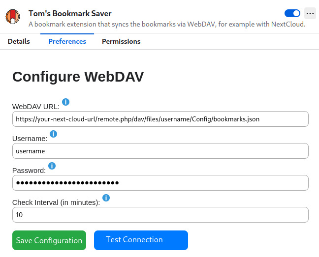

# Tom's Bookmark Saver

What: Tom's Bookmark Saver is a browser extension designed to synchronize bookmarks between your local browser and a remote WebDAV server. It handles authentication, fetching, updating, and synchronizing of bookmarks to ensure data consistency between local and remote sources. The extension also includes a confirmation interface for reviewing changes before they are applied.

Why: Since I have multiple machines which are synchronized with Nextcloud, I also wanted a simple solution for syncing bookmarks. Unfortunately, the export/import feature of Firefox creates files with a new timestamp, so I ended up with a lot of conflicts. Another option is to use FireFox sync, requiring yet another account, or alternatively [self-host](https://github.com/mozilla-services/syncstorage-rs) it. Both options are not optimal and I wanted to have something that works with my existing setup. Since I could not find anything, I built it.

How: Plain Javascript/HTML/CSS with ~700 lines of code.

## User Setup
To install the extension, follow these steps:

* Visit the [Tom's Bookmark Saver add-on page](https://addons.mozilla.org/en-US/firefox/addon/tom-s-bookmark-saver/).
* Click on the "Install" button to add the extension to your browser.

### Preferences
To make this plugin work, setup your webdav settings as shown in this screen:



You can test your configuration before saving it.

### Synchronization

There are 

## Developer Setup
1. If you want to extend or debug the extension, follow these steps:

   ```
   git clone git@github.com:tbocek/bookmark-tom.git
   ```
1. Open Firefox and navigate to:

    ```
    about:debugging#/runtime/this-firefox
    ```
1. Click on "Load Temporary Add-on..." and select the ```manifest.json``` file from the cloned repository.

1. The extension should now be visible in your browser. To apply code changes:
   * Click "Reload".
   * To view logs, click "Inspect". A new window will open where you can see the console logs.
