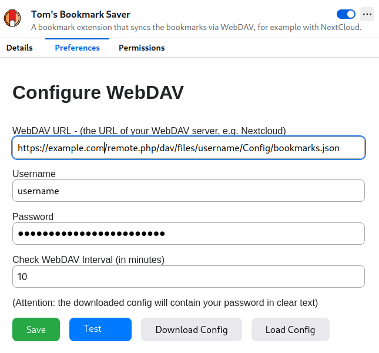

# Tom's Bookmark Saver

**What**: Tom's Bookmark Saver is a browser extension designed to synchronize bookmarks between your local browser and a remote WebDAV server. It handles authentication, fetching, updating, and synchronizing of bookmarks to ensure data consistency between local and remote sources. The extension also includes a confirmation interface for reviewing changes before they are applied.

**Why**: Since I have multiple machines which are synchronized with Nextcloud, I also wanted a simple solution for syncing bookmarks. Unfortunately, the export/import feature of Firefox creates files with modified content and a new timestamp, so I ended up with a lot of conflicts. Another option is to use FireFox sync, but this requires yet another account, or alternatively [self-host](https://github.com/mozilla-services/syncstorage-rs) it. Both options are not optimal and I wanted to have something that works with my existing setup. Since I could not find anything, I built it. Since the id of the bookmarks are not exposed via API, detecting changes is a bit cumbersome. Thus, changes of those bookmarks updates are presented to the user for a final check.

How: Plain Javascript with HTML/CSS with ~800 lines of code.

## User Setup
To install the extension, follow these steps:

* Visit the [Tom's Bookmark Saver add-on page](https://addons.mozilla.org/en-US/firefox/addon/tom-s-bookmark-saver/).
* Click on the "Install" button to add the extension to your browser.

### Preferences
To make this plugin work, setup your webdav settings as shown in this screen:



You can test your configuration before saving it.

### Synchronization

Depending if its a local sync or remote sync the following screen is shown

The local change:


The remote change:


To trigger a remote sync, click on the extension and click sync:


## Developer Setup
1. If you want to extend or debug the extension, follow these steps:

   ```
   git clone git@github.com:tbocek/bookmark-tom.git
   ```
1. Open Firefox and navigate to:

    ```
    about:debugging#/runtime/this-firefox
    ```
1. Click on "Load Temporary Add-on..." and select the ```manifest.json``` file from the cloned repository.

1. The extension should now be visible in your browser. To apply code changes:
   * Click "Reload".
   * To view logs, click "Inspect". A new window will open where you can see the console logs.


## Local Update Process

The local update process involves taking bookmarks from the remote WebDAV server and applying them to your local Firefox bookmarks. This process is initiated when the user chooses to update their local bookmarks based on changes detected on the remote server.

### Steps Involved
1. **Fetching Remote Bookmarks**: The extension first retrieves the bookmarks from the remote WebDAV server.

2. **Calculating Changes**:
   - The extension calculates the differences between the remote bookmarks and the current local bookmarks.
   - Changes are categorized into insertions, deletions, and updates (including changes in URL, title, index, and path).

3. **Modifying Local Bookmarks**:
   - **Deletions**: Bookmarks that exist locally but not remotely are deleted.
   - **Insertions**: Bookmarks that exist remotely but not locally are added to the local bookmarks.
   - **Updates**: Any differences in URL, title, index, or path between the two sets of bookmarks are applied to the local bookmarks.

4. **Rescanning Local Bookmarks**: After modifications, the extension re-fetches the local bookmarks and recalculates any changes to ensure consistency.

5. **Applying Updates**: Finally, the extension applies any remaining updates to local bookmarks.

6. **Final Synchronization**: If local changes were made (e.g., through a merge process), the extension may set the local bookmarks as the master and merge them with the remote bookmarks.

## Remote Update Process

The remote update process involves uploading your current local bookmarks to the remote WebDAV server, effectively making your local bookmarks the master copy.

### Steps Involved
1. **Fetching Local Bookmarks**: The extension retrieves all local bookmarks.

2. **Updating Remote Bookmarks**:
   - The extension uploads the local bookmarks to the WebDAV server.
   - This action overwrites the existing bookmarks file on the server with the new set from the local browser.

3. **Confirmation**:
   - Similar to the local update process, the extension may prompt the user for confirmation before making changes to the remote bookmarks.

### Confirmation and UI Interaction
Before applying changes, the extension may prompt the user through a confirmation page, allowing them to review the changes.

## Synchronization Triggers

### Automatic Sync
- The extension can automatically synchronize bookmarks at regular intervals. This is controlled by a background timer that checks for changes based on the configured interval.

### Manual Sync
- Users can manually trigger a synchronization by sending a message to the extension.

### Event-Driven Sync
- The extension listens for changes in local bookmarks (e.g., creation, deletion, movement) and can trigger a synchronization process in response.